# Panduan Komprehensif Platform Pengelolaan Sampah Wasman
## Dokumentasi Sistem, Arsitektur Ekonomi Sirkular, dan Petunjuk Operasional untuk 4 Tipe Pengguna

---

## 1. Pengenalan & Arsitektur Proyek Wasman

### 1.1 Latar Belakang & Visi Proyek
**Wasman (Waste Management Platform)** adalah platform digital terintegrasi yang dirancang untuk mentransformasi rantai pasok pengumpulan dan pengolahan sampah perkotaan menuju **Ekonomi Sirkular (*Circular Economy*)**. 

Di banyak perkotaan Indonesia, tantangan utama persampahan berpangkal pada:
1. **Rendahnya partisipasi pemilahan sampah di sumber (Rumah Tangga)** karena ketiadaan insentif dan kepastian jadwal angkut.
2. **Keterbatasan operasional dan logistik Komunitas/Bank Sampah/TPS 3R** dalam mengelola jadwal rutin, kapasitas armada, serta pencatatan timbangan yang masih manual.
3. **Kesenjangan pasokan industri daur ulang (Pabrik)** yang membutuhkan bahan baku daur ulang berkualitas tinggi dengan volume terukur, kadar kontaminasi rendah, dan kepastian asal material (*traceability*).

Platform Wasman hadir menjembatani ketiga simpul rantai nilai tersebut dalam satu ekosistem berbasis data yang transparan, efisien, dan memberikan nilai ekonomi bagi seluruh pihak.

```
                  ┌────────────────────────────────────────┐
                  │          ADMINISTRATOR / DLH           │
                  │ Regulasi, Standar Harga, Master Data,  │
                  │   Audit Lingkungan & Verifikasi Akun   │
                  └───────────────────┬────────────────────┘
                                      │
       ┌──────────────────────────────┼──────────────────────────────┐
       │                              │                              │
┌──────▼───────────────┐   ┌──────────▼───────────┐   ┌──────────────▼───────┐
│     RUMAH TANGGA     │   │      KOMUNITAS       │   │        PABRIK        │
│  Penghasil & Pemilah │──>│  Agregator Logistik, │──>│   Offtaker Industri  │
│    Insentif Poin/Rp  │   │  Timbangan & Gudang  │   │   Daur Ulang Akhir   │
└──────────────────────┘   └──────────────────────┘   └──────────────────────┘
       ▲                              ▲                              ▲
       └─────────── Transaksi Finansial, Logistik & Jejak Karbon ────┘
```

---

### 1.2 Pilar Ekonomi Sirkular Wasman
Wasman mengubah paradigma sampah dari "kumpul-angkut-buang" menjadi material bernilai tambah:
- **Rumah Tangga**: Memperoleh kompensasi langsung berupa uang tunai, poin loyalitas, voucher belanja, atau potongan iuran kebersihan berdasarkan berat dan jenis material yang dipilah.
- **Komunitas / TPS 3R**: Memperoleh imbal jasa angkut, komisi agregator, dan margin penjualan material berkualitas ke pabrik.
- **Pabrik Daur Ulang**: Memperoleh kepastian bahan baku terpilah dengan kontaminasi rendah (<5%), mengurangi biaya pemilahan ulang (*sorting cost*), serta mempermudah kepatuhan pelaporan keberlanjutan (ESG).
- **Admin / DLH**: Mendapatkan visibilitas data timbulan sampah kota *real-time*, metrik reduksi karbon, serta efisiensi anggaran pengelolaan sampah daerah.

---

### 1.3 Matriks Peran 4 Tipe Pengguna

| Peran | Tipe Pengguna | Perangkat Utama | Fungsi Kunci dalam Platform |
|---|---|---|---|
| **1. Rumah Tangga** | Warga / Penghasil Sampah | Mobile PWA / Smartphone | Memilah sampah, konfirmasi jadwal rutin, ajukan angkut khusus/bernilai, lacak timbangan, kumpulkan poin reward. |
| **2. Komunitas** | Pengurus Bank Sampah / TPS 3R / Petugas | Mobile PWA & Desktop Web | Kelola rute dan armada, tugaskan petugas lapangan, input timbangan digital, konsolidasi material, jual ke pabrik. |
| **3. Pabrik** | Industri Daur Ulang / Offtaker | Desktop Web (Utama) & Mobile | Rilis kebutuhan bahan baku (demand B2B), inspeksi kualitas (QC), verifikasi timbangan bruto-tara-netto, pembayaran supplier. |
| **4. Administrator** | Superadmin / Dinas Lingkungan Hidup | Desktop Web | Tata kelola master data (kategori sampah, harga acuan), audit transaksi, verifikasi legalitas mitra, analitik makro kota. |

---

### 1.4 Halaman Utama Publik (Landing Page)
Halaman depan Wasman dirancang modern, ramah pengguna, dan komunikatif untuk memperkenalkan solusi platform, dampak lingkungan terukur (tonase sampah terkelola, jumlah mitra aktif), serta akses cepat pendaftaran bagi seluruh pemangku kepentingan.

#### Tampilan Mode Website (Desktop)
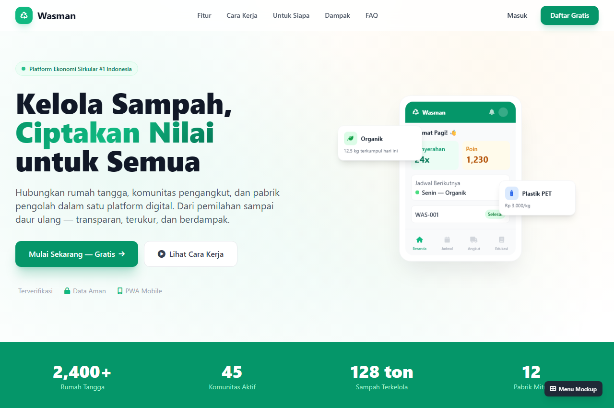

#### Tampilan Mode Mobile
<p align="center">
  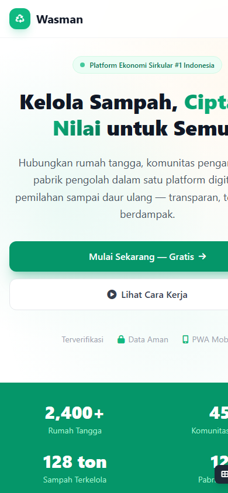
</p>

---

## 2. Alur Akses & Autentikasi Sistem

Wasman menyediakan gerbang autentikasi terpusat yang aman dengan sistem pengalihan otomatis (*role-based redirection*) berdasarkan hak akses pengguna yang terdaftar.

### 2.1 Alur Masuk (Login)
1. Buka tautan login Wasman.
2. Masukkan alamat email atau nomor WhatsApp aktif serta kata sandi.
3. Klik tombol **Masuk**.
4. Sistem secara otomatis memverifikasi kredensial dan mengarahkan pengguna ke dashboard sesuai perannya:
   - Warga Rumah Tangga ➔ `/household/dashboard`
   - Pengurus / Petugas Komunitas ➔ `/community/dashboard`
   - Manajer Logistik Pabrik ➔ `/factory/dashboard`
   - Tim Administrator ➔ `/admin/dashboard`

| Mode Website (Desktop) | Mode Mobile |
| :---: | :---: |
| 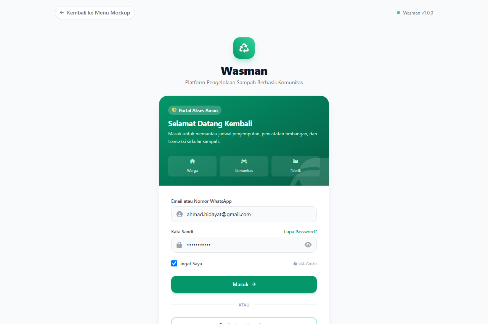 | 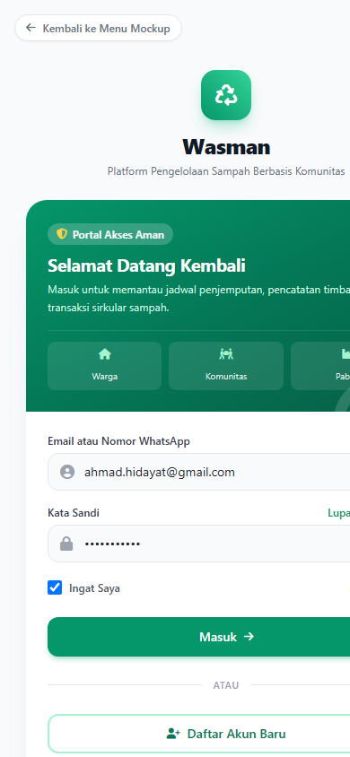 |

---

### 2.2 Alur Pendaftaran (Register)
Calon pengguna dapat mendaftar dengan memilih jenis entitas yang sesuai:
1. **Rumah Tangga**: Pendaftaran individu warga dengan menyertakan nama kepala keluarga, nomor handphone, alamat RT/RW, dan titik koordinat jemput.
2. **Komunitas / Bank Sampah**: Pendaftaran unit pengumpul atau TPS 3R dengan menyertakan nama organisasi, penanggung jawab, wilayah binaan, dan armada yang dimiliki.
3. **Pabrik Pengolah**: Pendaftaran perusahaan daur ulang dengan legalitas NIB/AMDAL, jenis fasilitas daur ulang, dan spesifikasi material yang dibutuhkan.

| Mode Website (Desktop) | Mode Mobile |
| :---: | :---: |
| 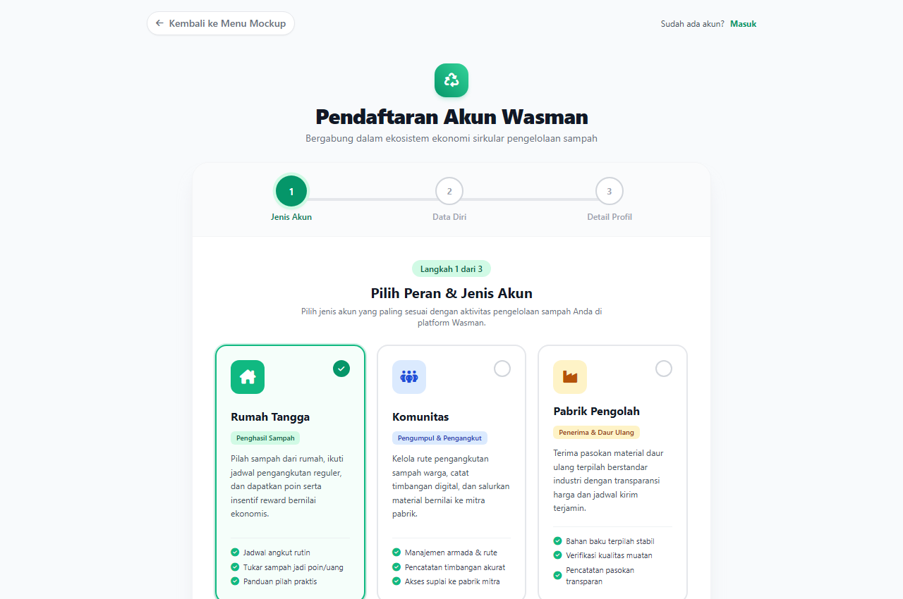 | 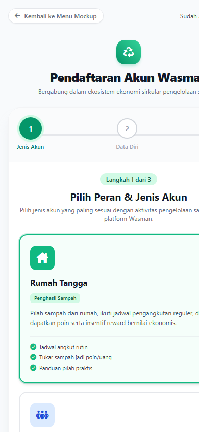 |

---

## 3. Panduan Pengguna 1: Rumah Tangga (Household / Warga)

Rumah tangga merupakan simpul hulu terpenting. Kualitas daur ulang sangat bergantung pada pemilahan di tingkat rumah tangga.

### 3.1 Beranda (Dashboard) Warga
Dashboard memberikan informasi ringkas mengenai performa pemilahan sampah warga:
- **Statistik Akumulatif**: Jumlah penyerahan sampah, total berat sampah terpilah (kg), perolehan poin yang dapat ditukar, dan rating kepatuhan pemilahan.
- **Jadwal Angkut Terdekat**: Menampilkan hari dan jenis sampah (misal: *Senin, 22 Sep — Sampah Organik*).
- **Aksi Cepat "Saya Ada Sampah"**: Memberi sinyal kepada petugas komunitas bahwa warga memiliki sampah siap jemput.
- **Riwayat Singkat & Tips Pemilahan Harian**: Edukasi praktis agar nilai ekonomi material meningkat.

| Mode Website (Desktop) | Mode Mobile |
| :---: | :---: |
| 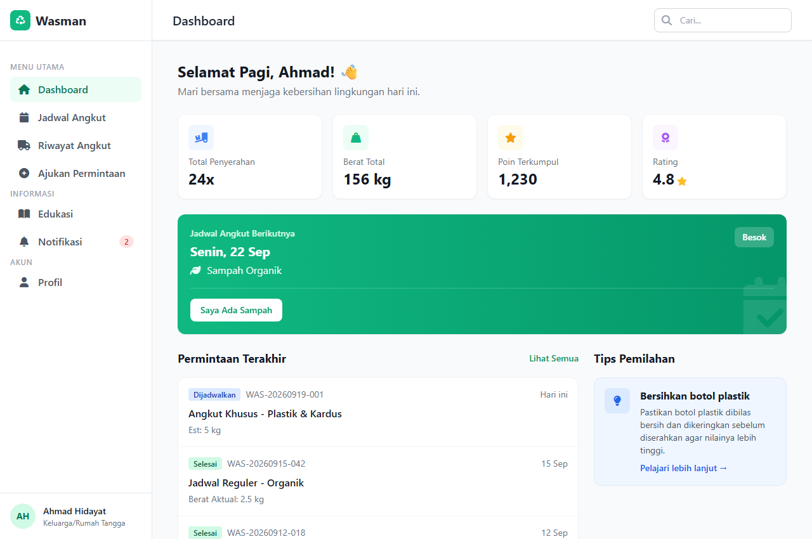 | 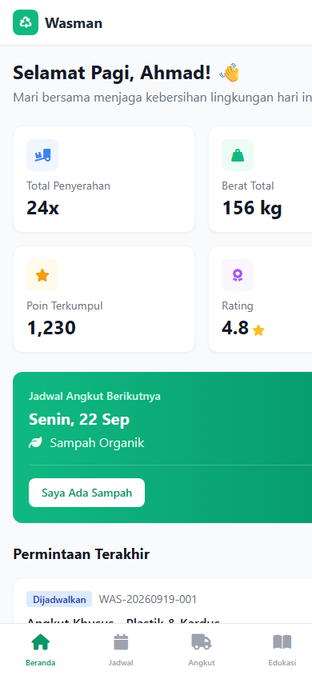 |

---

### 3.2 Memeriksa Jadwal Angkut Reguler
Jadwal pengangkutan reguler diatur oleh Komunitas pengelola wilayah setempat (misal: Senin untuk Organik, Rabu untuk Plastik/Kertas, Jumat untuk Residu).

#### Cara Menggunakan:
1. Buka menu **Jadwal Angkut** pada bilah navigasi.
2. Periksa jadwal untuk pekan berjalan. Sistem menampilkan jenis sampah yang diangkut pada tiap hari operasional.
3. Jika Anda telah memilah sampah dan siap menyerahkannya, klik tombol hijau **"Saya Ada Sampah"** pada kartu hari terkait.
4. Petugas lapangan akan menerima notifikasi titik penjemputan aktif di rute hari tersebut.

| Mode Website (Desktop) | Mode Mobile |
| :---: | :---: |
| 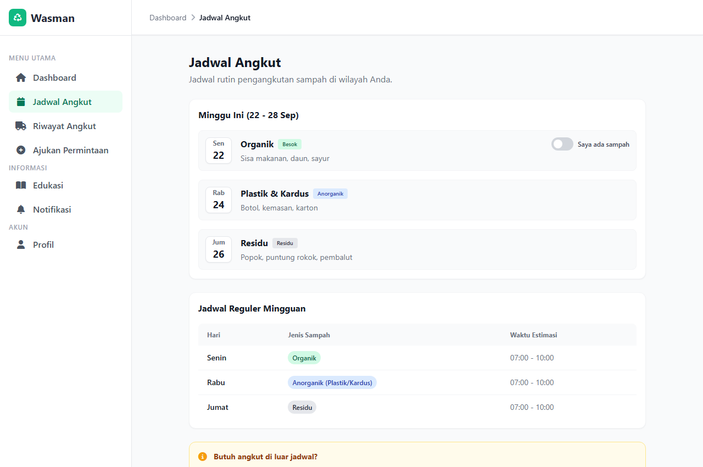 | 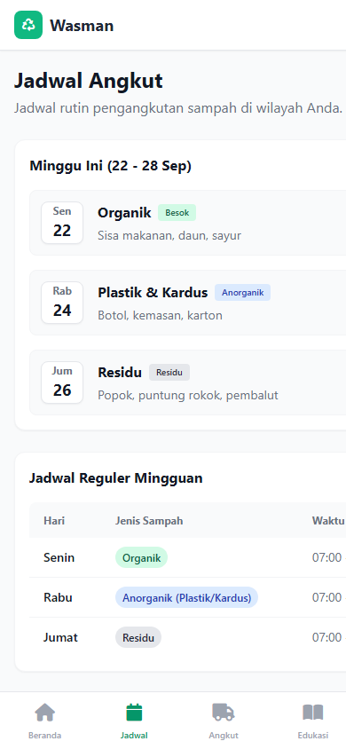 |

---

### 3.3 Mengajukan Permintaan Pengangkutan Khusus / Bernilai
Permintaan pengangkutan khusus digunakan ketika warga memiliki sampah dalam volume besar atau kategori khusus (kardus dalam jumlah besar, barang elektronik bekas, perabotan rusak, minyak jelantah, dsb.) di luar jadwal reguler.

#### Cara Mengajukan:
1. Masuk ke menu **Ajukan Permintaan** (ikon tambah).
2. Pilih **Kategori Sampah** (misal: *Plastik & Kardus*, *Elektronik*, atau *Minyak Jelantah*).
3. Masukkan perkiraan berat atau jumlah barang (misal: *5 kg* atau *1 unit*).
4. Pilih tanggal dan estimasi jam penjemputan yang diinginkan.
5. Unggah foto material sampah untuk verifikasi awal petugas.
6. Berikan catatan lokasi spesifik (misal: *"Sampah diletakkan di depan garasi pagar hitam"*).
7. Klik **Kirim Permintaan**. Status pengajuan akan berstatus `Menunggu Persetujuan`.

| Mode Website (Desktop) | Mode Mobile |
| :---: | :---: |
| 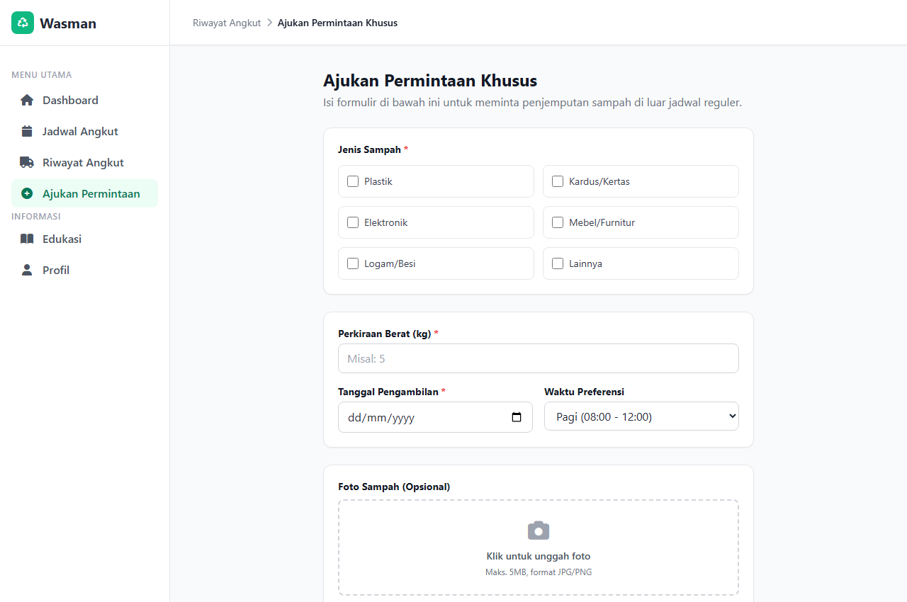 | 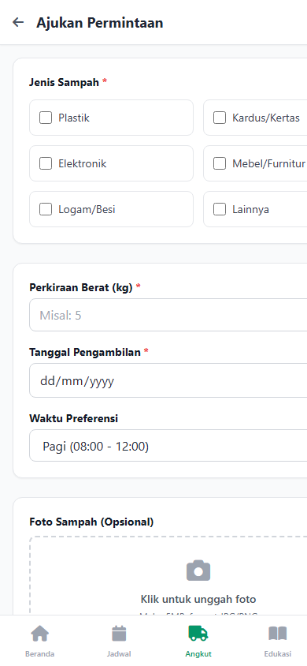 |

---

### 3.4 Memantau Riwayat & Status Pengangkutan
Warga dapat memantau seluruh proses penjemputan sampah secara transparan melalui menu **Riwayat Angkut**.

#### Indikator Status:
- `Menunggu Persetujuan`: Permintaan sedang ditinjau oleh operator komunitas.
- `Dijadwalkan`: Permintaan disetujui dan telah dialokasikan ke petugas & armada.
- `Dalam Perjalanan`: Petugas sedang bergerak menuju lokasi rumah tangga.
- `Selesai`: Sampah berhasil diangkut, ditimbang, dan poin insentif telah diterbitkan.

| Mode Website (Desktop) | Mode Mobile |
| :---: | :---: |
| 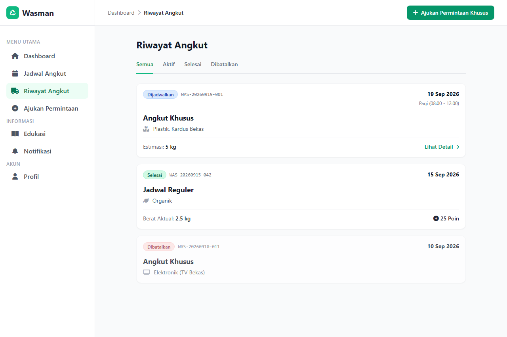 | 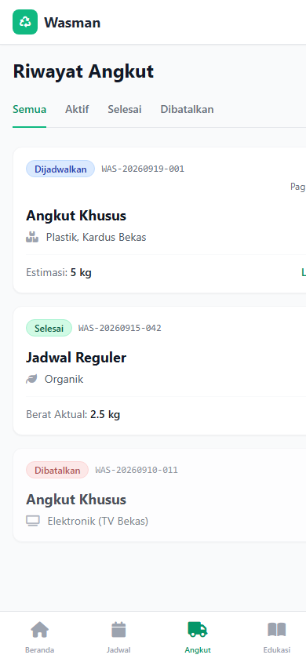 |

---

### 3.5 Detail Transaksi, Verifikasi Timbangan & Pemberian Rating
Setelah penjemputan selesai, warga dapat membuka rincian tiket untuk melihat transparansi data:
1. **Berat Aktual Timbangan**: Hasil timbang digital yang dilakukan petugas saat serah terima.
2. **Foto Bukti Penjemputan**: Dokumentasi foto serah terima material.
3. **Poin / Nilai Insentif**: Poin reward yang otomatis ditambahkan ke saldo warga.
4. **Formulir Rating Layanan**: Warga dapat memberikan bintang 1-5 dan ulasan terhadap keramahan petugas, ketepatan waktu, dan akurasi timbangan.

| Mode Website (Desktop) | Mode Mobile |
| :---: | :---: |
| 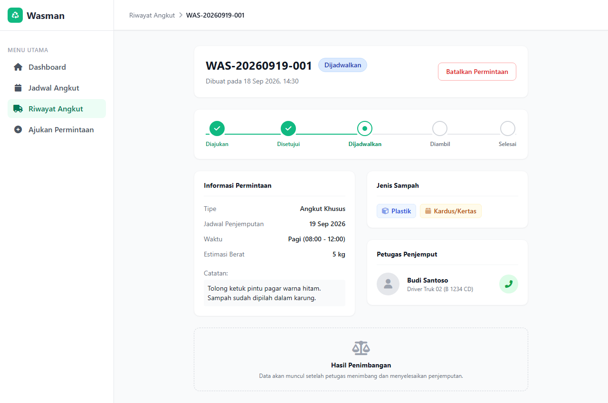 | 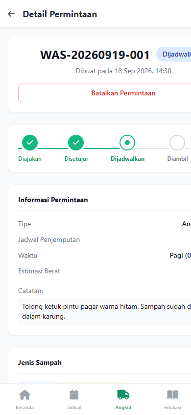 |

---

### 3.6 Pusat Edukasi & Panduan Pemilahan Sampah
Wasman menyediakan modul edukasi interaktif untuk meningkatkan literasi 3R warga:
- **Katalog Panduan**: Petunjuk teknis memilah material organik, plastik PET/HDPE, kertas karton, kaca, hingga limbah B3 rumah tangga (baterai, lampu).
- **Standar Kebersihan Material**: Edukasi cara mencuci bersih botol plastik sebelum disetor agar bernilai tinggi dan bebas kontaminasi.
- **Artikel Detail**: Penjelasan dampak lingkungan dari setiap jenis sampah dan siklus daur ulangnya.

| Mode Website (Desktop) | Mode Mobile |
| :---: | :---: |
| 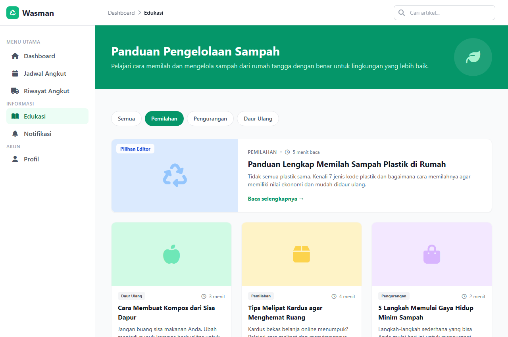 | 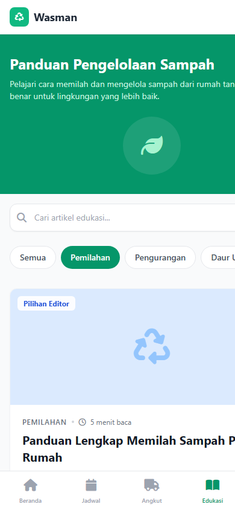 |
| 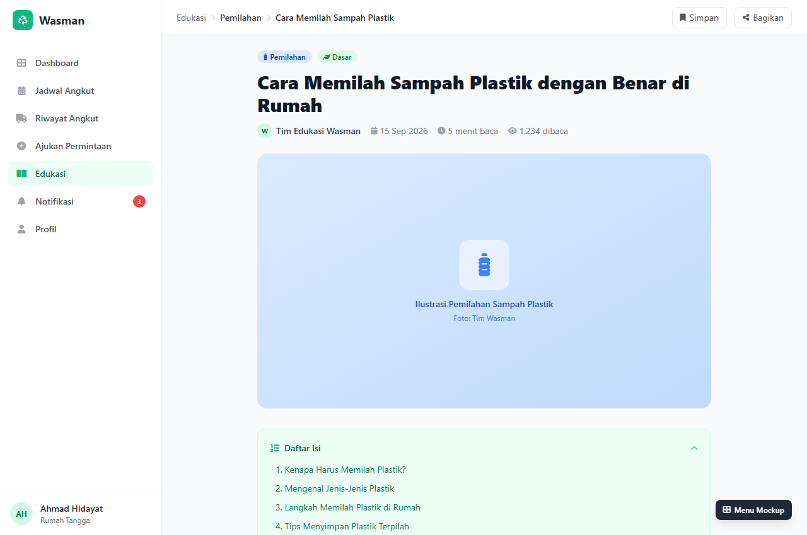 | 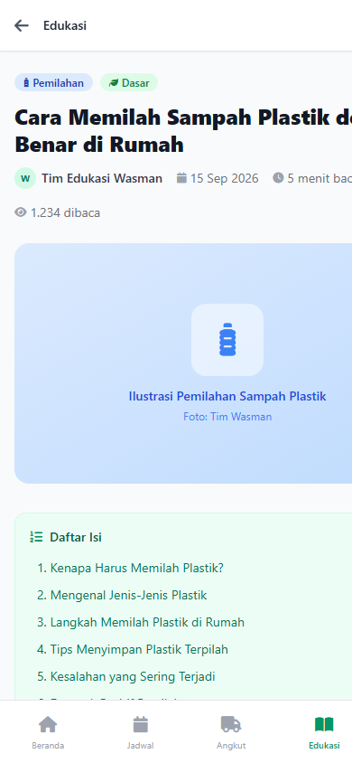 |

---

### 3.7 Profil Akun & Pusat Notifikasi
- **Profil**: Pengaturan data keluarga, nomor telepon WhatsApp untuk konfirmasi penjemputan, serta titik pin peta alamat domisili.
- **Notifikasi**: Pemberitahuan otomatis ketika jadwal angkut besok tiba, saat petugas mulai berjalan ke rumah, dan saat timbangan disahkan.

| Fitur | Mode Website (Desktop) | Mode Mobile |
|---| :---: | :---: |
| **Profil Warga** | 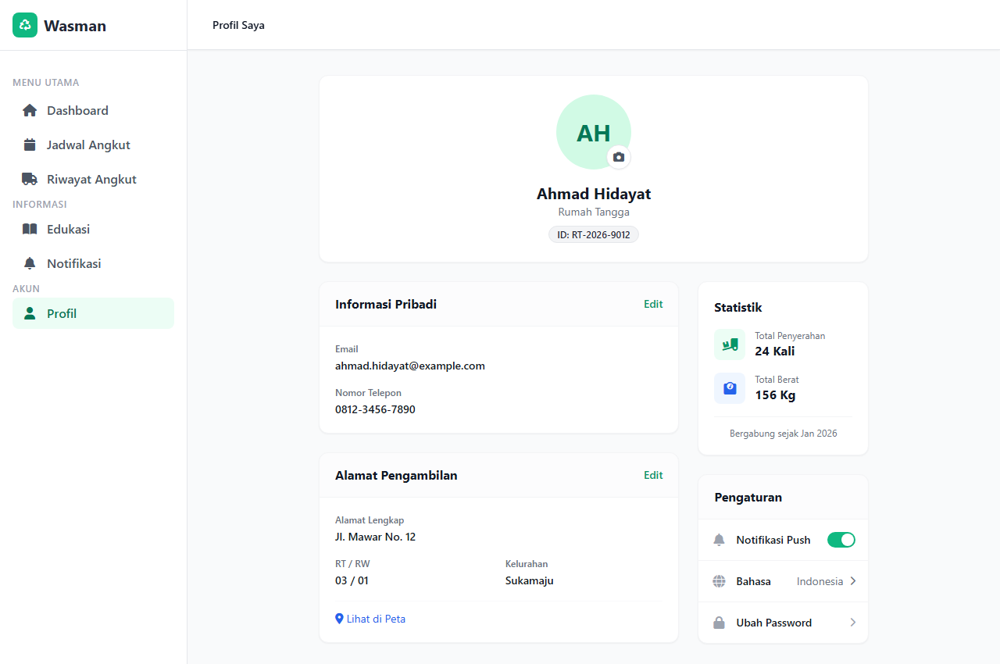 | 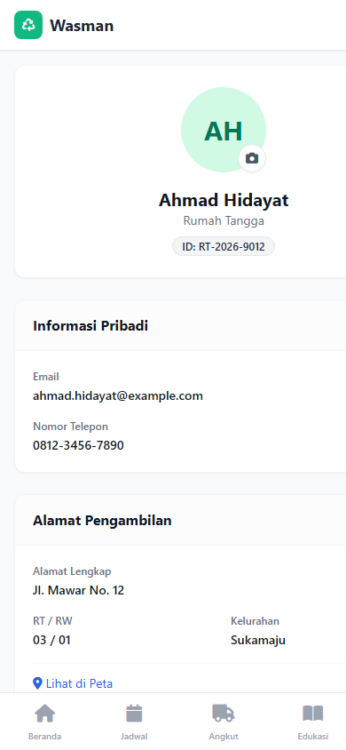 |
| **Pusat Notifikasi** | 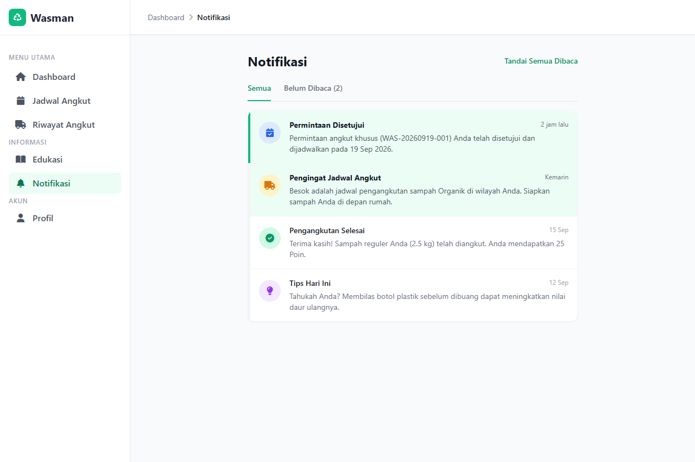 | 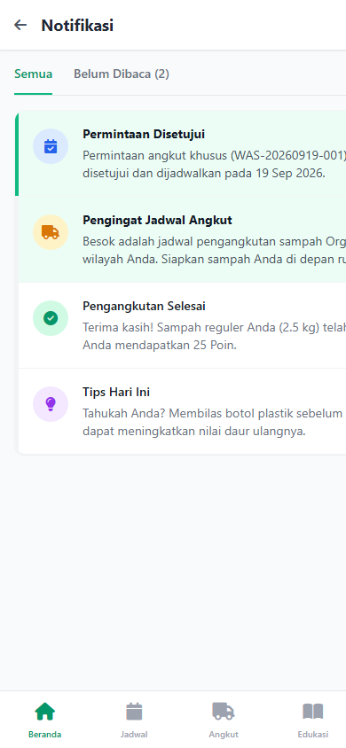 |

---

## 4. Panduan Pengguna 2: Komunitas / Bank Sampah / TPS 3R (Community)

Komunitas berfungsi sebagai **agregator logistik lokal**, menghubungkan ribuan rumah tangga dengan pabrik pengolah sampah.

### 4.1 Dashboard Operasional Komunitas
Dashboard ini menjadi ruang kendali harian pengurus Bank Sampah atau TPS 3R:
- **Kartu Ringkasan Metrik**: Jumlah tugas lapangan hari ini, total RT yang dilayani aktif, volume sampah terkumpul bulan berjalan (ton), dan rata-rata rating kepuasan warga.
- **Panel "Perlu Tindakan"**: Menampilkan permohonan pengangkutan khusus dari warga yang menunggu konfirmasi (Setujui / Tolak).
- **Status Tim Lapangan**: Memantau posisi petugas aktif (sedang perjalanan, selesai angkut, atau istirahat).
- **Grafik Volume Harian**: Memantau fluktuasi timbulan sampah dari Senin hingga Minggu.

| Mode Website (Desktop) | Mode Mobile |
| :---: | :---: |
| 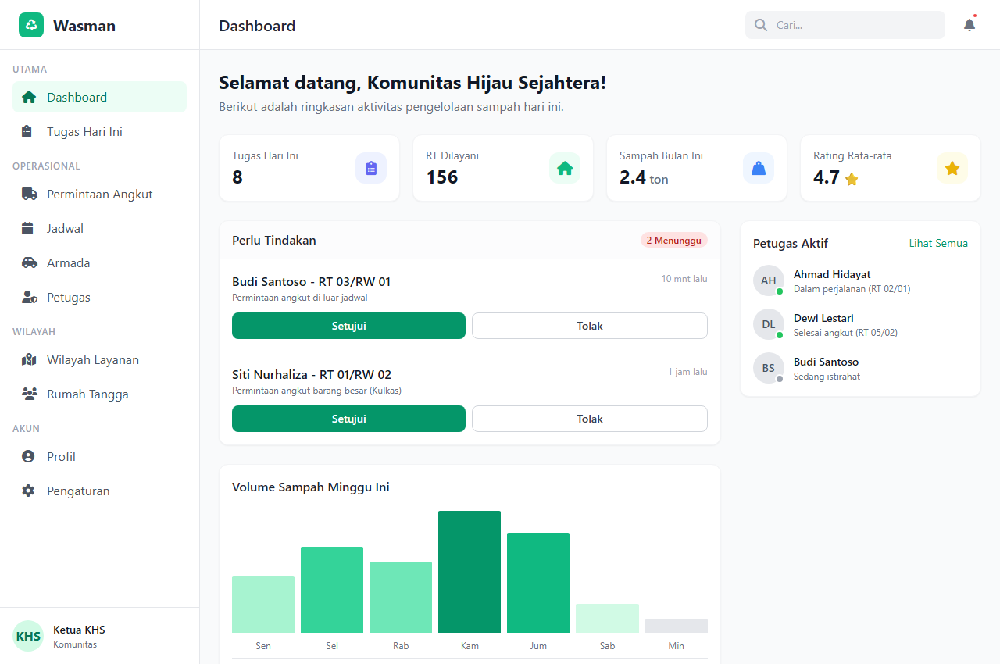 | 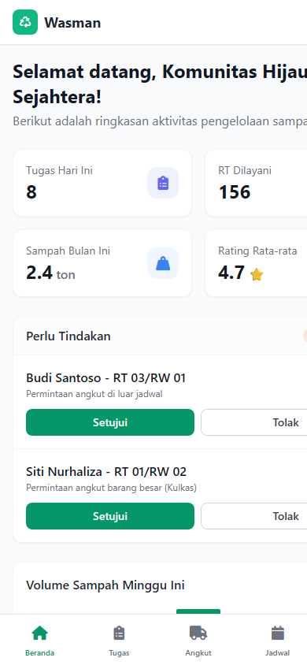 |

---

### 4.2 Pelaksanaan Tugas Harian Lapangan (Field Tasks)
Fitur ini dioptimalkan khusus untuk **petugas angkut lapangan** yang menggunakan smartphone saat mengemudikan armada motor roda tiga atau mobil bak.

#### Alur Kerja Petugas di Lapangan:
1. Buka menu **Tugas Hari Ini**.
2. Sistem mengelompokkan tugas berdasarkan status: `Pending`, `Dalam Perjalanan`, dan `Selesai`.
3. Saat berangkat menuju lokasi penjemputan, petugas menekan tombol hijau **"Mulai"**. Status berubah menjadi `Dalam Perjalanan` dan warga menerima notifikasi kedatangan.
4. Tiba di rumah warga, petugas menimbang sampah dan menginput hasil timbang serta mengambil foto bukti serah terima.
5. Petugas menekan tombol **"Selesai"**. Data langsung tersinkronisasi ke server dan saldo poin warga otomatis diperbarui.

| Mode Website (Desktop) | Mode Mobile |
| :---: | :---: |
| 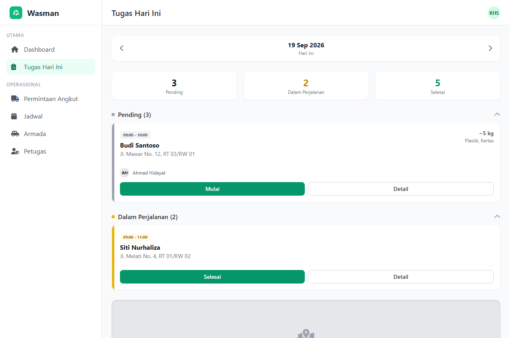 | 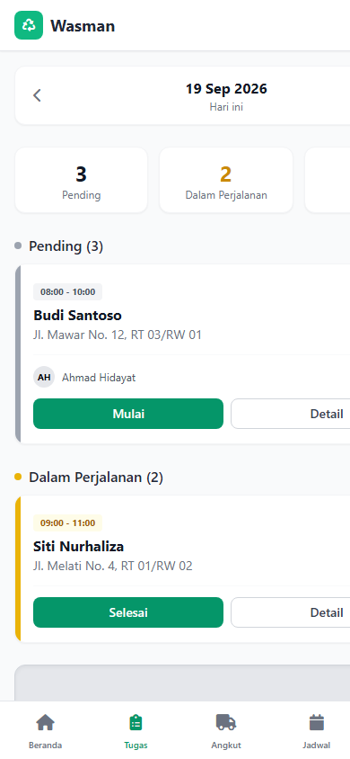 |

---

### 4.3 Manajemen Permintaan Pengangkutan Warga & Penugasan Petugas
Pengurus komunitas dapat melihat seluruh permohonan angkut masuk, baik yang berasal dari jadwal reguler maupun permintaan khusus bernilai.

#### Cara Menugaskan Petugas & Armada (*Dispatching*):
1. Buka menu **Permintaan Angkut**.
2. Pilih tiket permintaan yang berstatus `Menunggu Persetujuan` atau `Baru`.
3. Klik tombol **Detail / Review** untuk membuka halaman rincian.
4. Periksa kategori sampah, estimasi berat, dan lokasi rumah tangga.
5. Pada bagian penugasan, pilih nama **Petugas Lapangan** yang bertugas dan pilih **Kendaraan Armada** yang tersedia.
6. Klik **Konfirmasi & Jadwalkan**. Tiket secara otomatis masuk ke antrean tugas petugas terkait.

| Fitur | Mode Website (Desktop) | Mode Mobile |
|---| :---: | :---: |
| **Daftar Permintaan Masuk** | 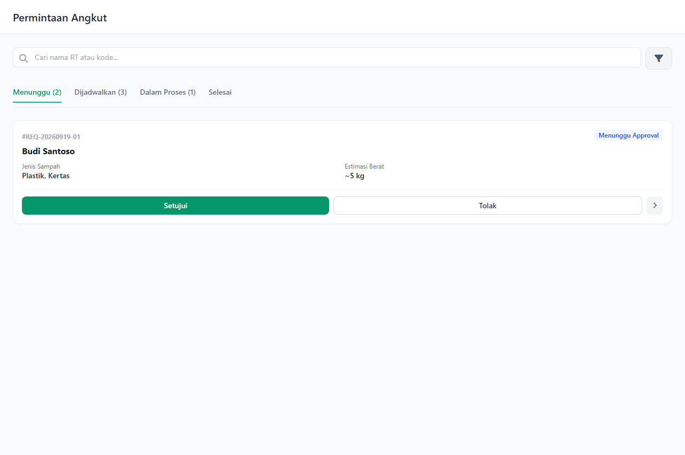 | 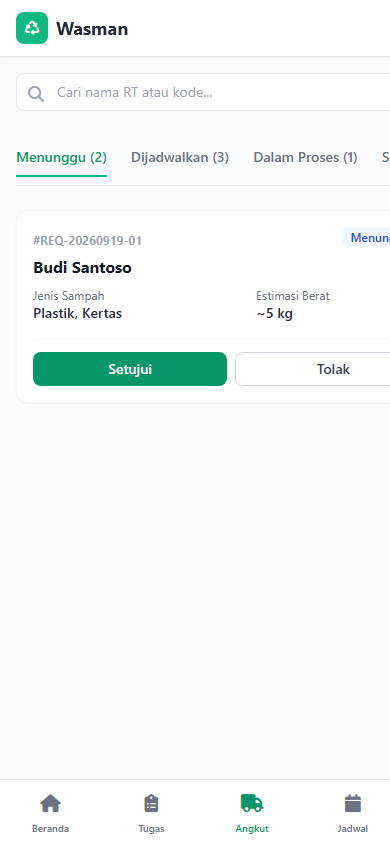 |
| **Detail Review & Penugasan Petugas** | 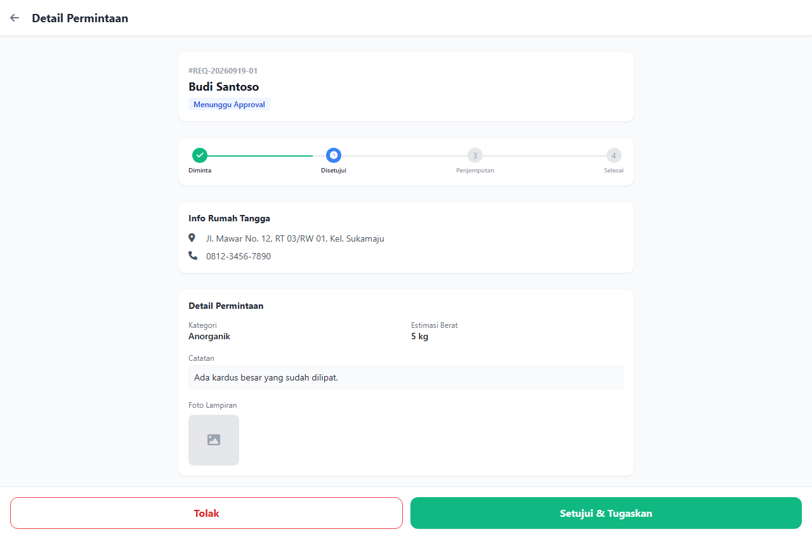 | 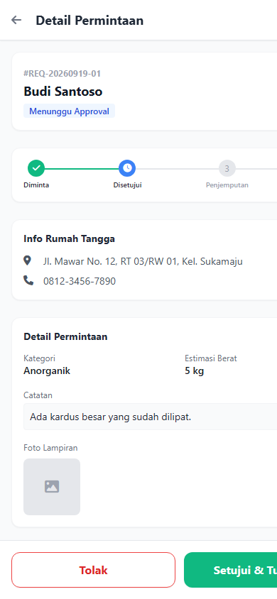 |

---

### 4.4 Pengaturan Jadwal Angkut Reguler
Komunitas memegang kendali penuh dalam menetapkan kalender angkut rutin agar armada dan personil tidak mengalami kelebihan beban (*overcapacity*).

#### Cara Membuat Jadwal Baru:
1. Buka menu **Jadwal** ➔ Klik tombol **Buat Jadwal Baru**.
2. Pilih **Wilayah Layanan** (misal: *RW 01* atau *RW 02*).
3. Tentukan **Hari Operasional** (Senin - Minggu) dan rentang jam pelayanan.
4. Pilih **Kategori Sampah** yang diangkut pada hari tersebut (Organik / Anorganik / Residu).
5. Tentukan kapasitas kuota maksimal rumah tangga yang dapat ditangani.
6. Klik **Simpan Jadwal**. Jadwal akan otomatis tampil pada aplikasi seluruh warga di wilayah tersebut.

| Fitur | Mode Website (Desktop) | Mode Mobile |
|---| :---: | :---: |
| **Kalender Jadwal Rutin** | 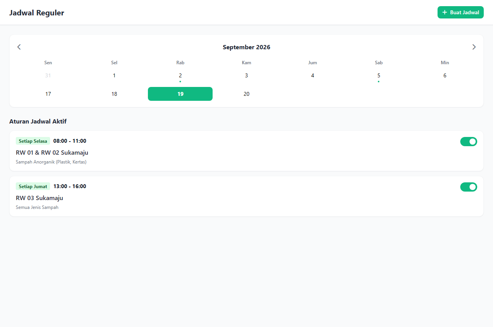 | 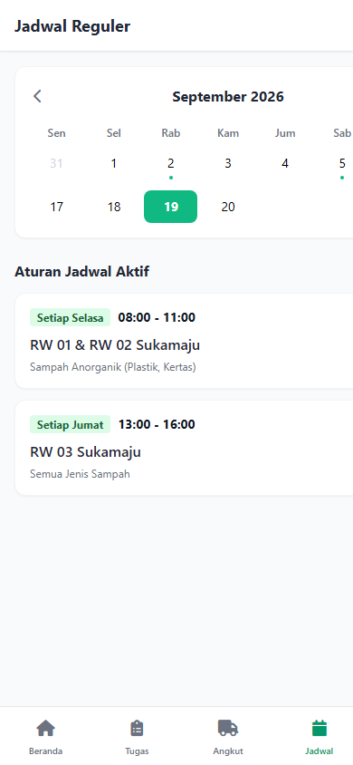 |
| **Formulir Buat Jadwal Baru** | 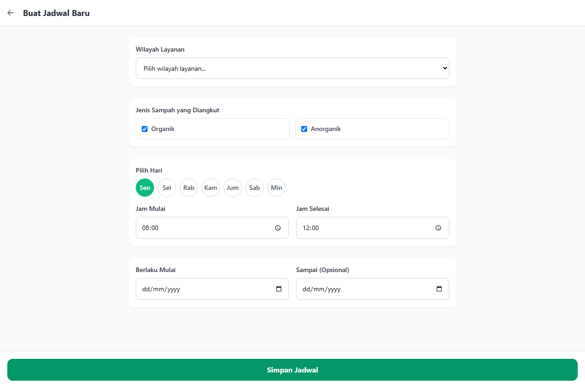 | 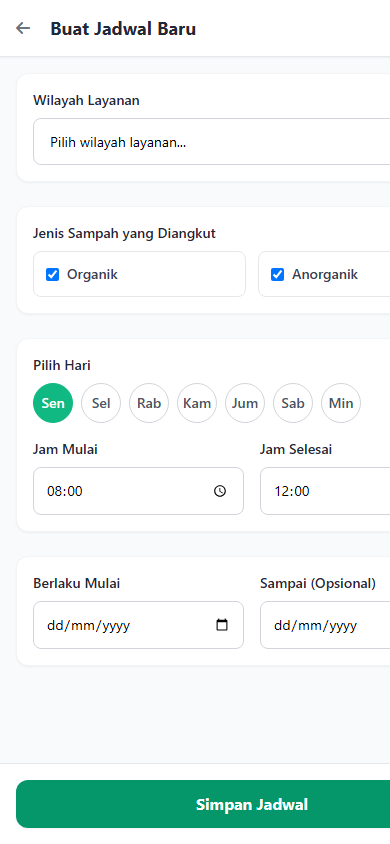 |

---

### 4.5 Manajemen Armada, Petugas & Wilayah Binaan
Untuk menjaga keberlanjutan operasional, pengurus komunitas dapat mengelola sumber daya internal:
- **Kelola Armada**: Mendaftarkan inventaris kendaraan (Tossa Roda Tiga, Mobil Pickup, Truk Sampah Kecil), kapasitas volume muatan, nomor plat, dan jadwal servis.
- **Kelola Petugas**: Mendaftarkan identitas anggota regu pengangkut, nomor kontak, serta memantau rekam jejak penyelesaian tugas.
- **Wilayah Layanan & Rumah Tangga**: Mengatur batas cakupan wilayah kerja (RT/RW) dan mengelola database warga terdaftar beserta riwayat partisipasi pemilahannya.

| Menu | Mode Website (Desktop) | Mode Mobile |
|---| :---: | :---: |
| **Manajemen Armada** | 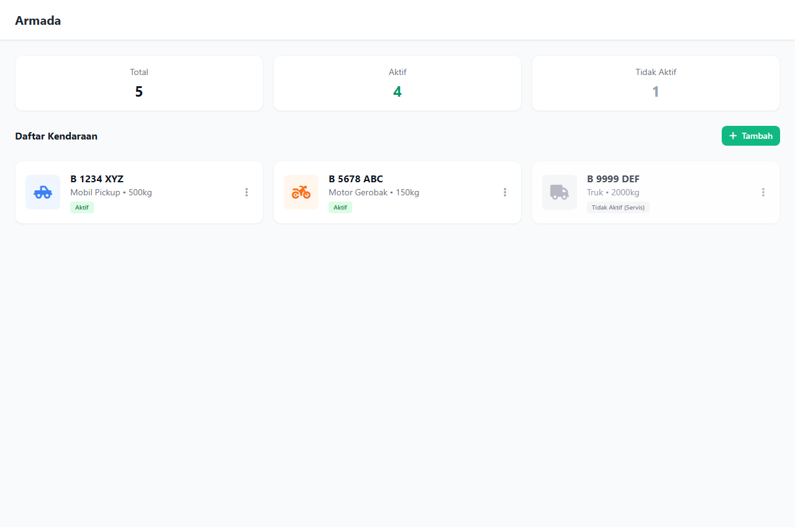 | 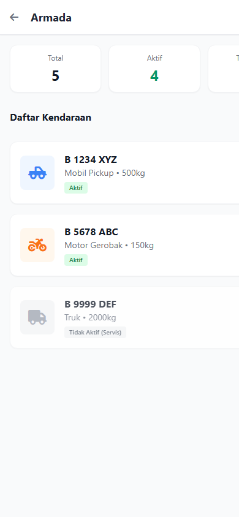 |
| **Manajemen Petugas** | 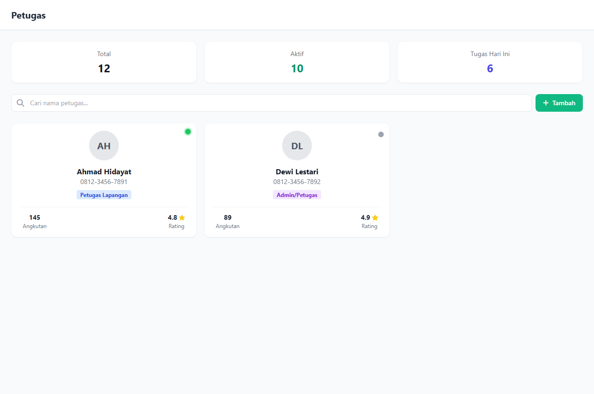 | 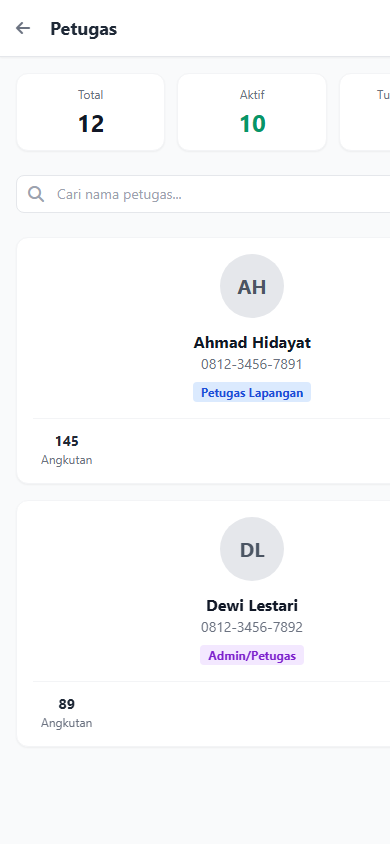 |
| **Wilayah Layanan** | 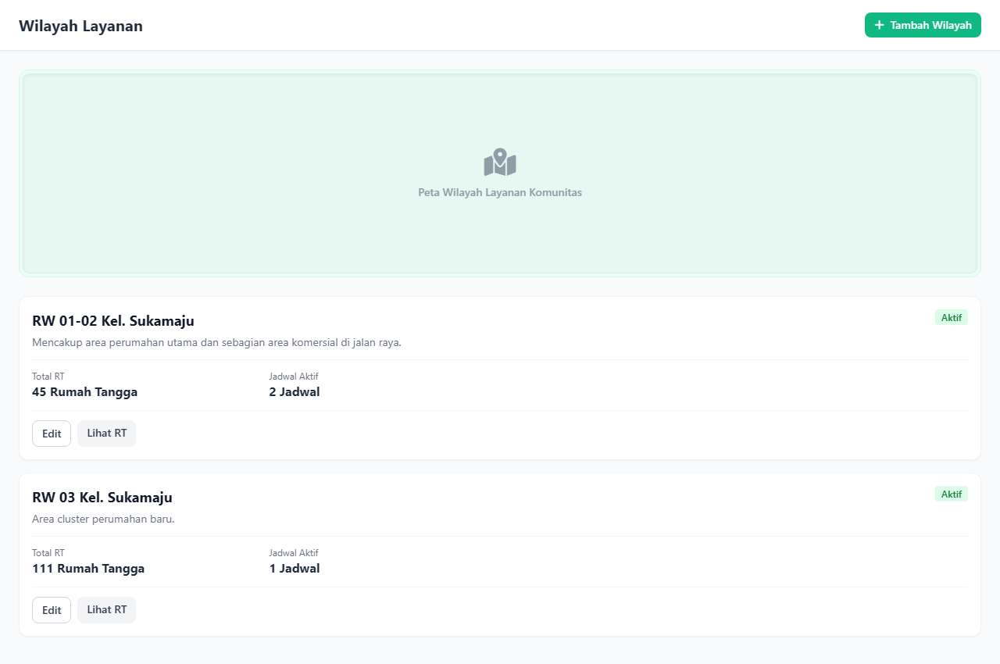 | 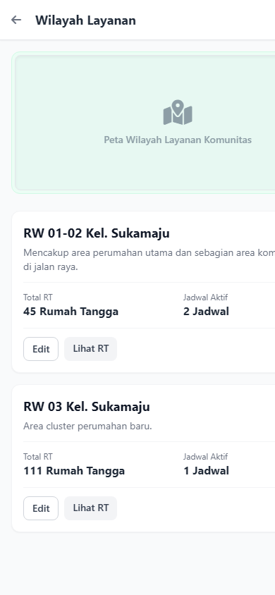 |
| **Database Rumah Tangga** | 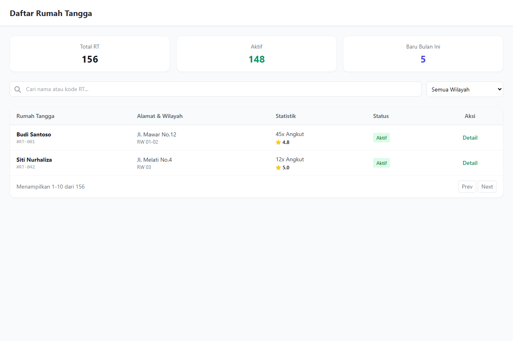 | 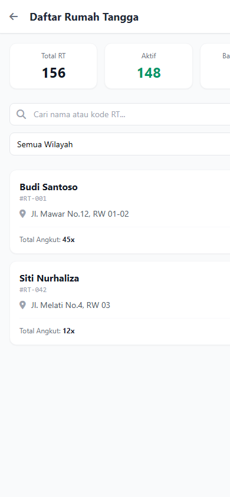 |

---

## 5. Panduan Pengguna 3: Pabrik Pengolah / Recycler (Factory)

Pabrik pengolah berperan sebagai **pembeli akhir (*offtaker*)** yang menyerap material terpilah dari komunitas untuk didaur ulang menjadi produk baru.

### 5.1 Dashboard Industri Pabrik
Dashboard pabrik difokuskan pada manajemen rantai pasok bahan baku dan keterisian kapasitas produksi:
- **Metrik Pasokan Bulanan**: Jumlah armada truk pasokan yang masuk, total tonase material diterima (kg), jumlah komunitas mitra aktif, dan rata-rata skor mutu (*Grade A/B/C*).
- **Komposisi Material Diterima**: Grafik proporsi jenis material yang masuk (Botol PET Bening, HDPE Tutup Galon, Kardus Karton Box, PP Gelas Minuman).
- **Leaderboard Komunitas Terbaik**: Peringkat komunitas pemasok berdasarkan tonase dan kepatuhan standar kemurnian material.
- **Status Jembatan Timbang**: Memantau operasional timbangan truk pabrik (*Weighbridge*).

| Mode Website (Desktop) | Mode Mobile |
| :---: | :---: |
| 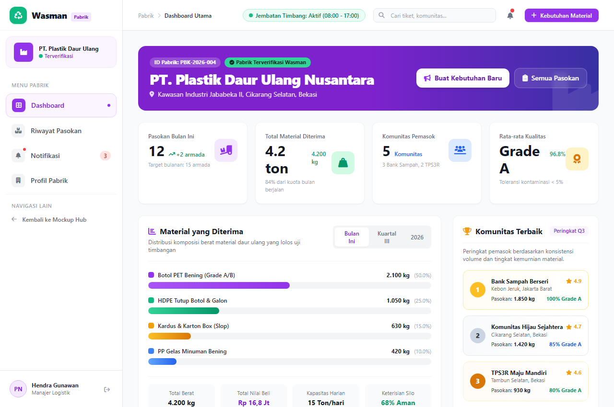 | 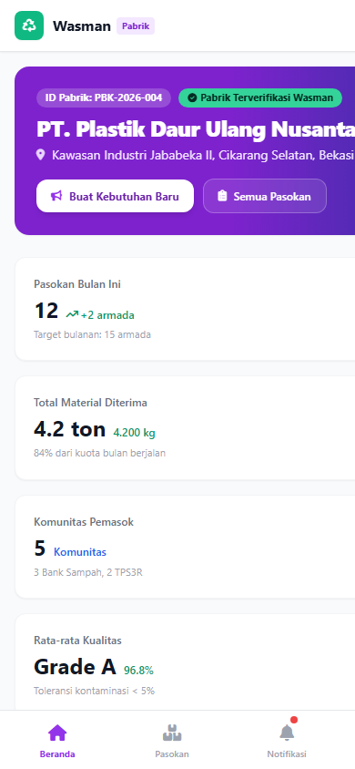 |

---

### 5.2 Profil Pabrik & Pengaturan Kebutuhan Material (B2B Demand)
Pabrik dapat mempublikasikan katalog kebutuhan bahan baku agar komunitas dapat mempersiapkan pasokan yang sesuai dengan standar industri.

#### Informasi yang Dikelola:
- **Legalitas & Kapasitas Industri**: Izin operasional lingkungan, lokasi fasilitas pabrik, dan kapasitas olah harian.
- **Katalog Material & Standar Mutu**:
  - *Botol PET Bening*: Standar kontaminasi < 5%, tanpa label PVC, harga beli Rp 3.000 / kg.
  - *HDPE Tutup Botol & Galon*: Kering dan bersih, harga beli Rp 4.500 / kg.
  - *Kardus & Karton Slop*: Kering, tidak berminyak, harga beli Rp 1.800 / kg.
- **Tombol "Buat Kebutuhan Baru"**: Memungkinkan pabrik menerbitkan permintaan borongan (misal: *"Dibutuhkan 5 Ton Botol PET untuk pengiriman akhir bulan"*).

| Mode Website (Desktop) | Mode Mobile |
| :---: | :---: |
| 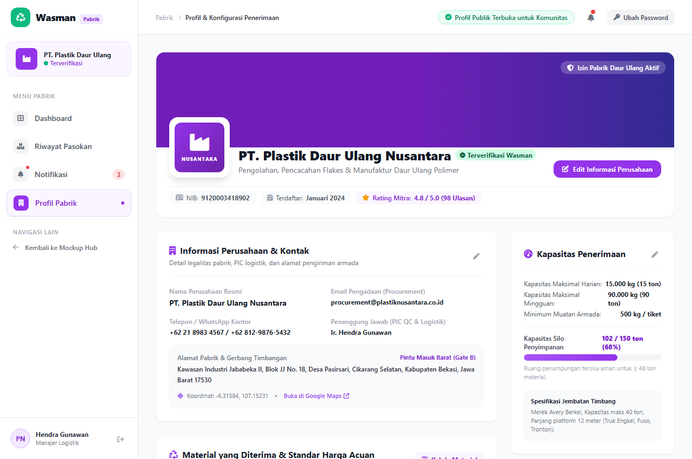 | 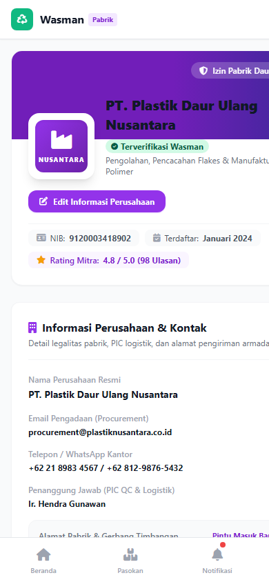 |

---

### 5.3 Riwayat Pasokan, Uji Kualitas (QC) & Verifikasi Timbangan
Setiap truk pengiriman dari komunitas yang tiba di pabrik melalui proses penerimaan yang ketat:
1. **Pemeriksaan Tiket Pengiriman**: Memverifikasi asal komunitas dan surat jalan digital.
2. **Penimbangan Jembatan Timbang**:
   - Berat Bruto (truk + muatan).
   - Berat Tara (truk kosong setelah dibongkar).
   - Berat Netto = Bruto - Tara.
3. **Uji Kontaminasi (QC Inspection)**: Sampel acak diperiksa untuk memastikan persentase pengotor tidak melampaui batas toleransi.
4. **Penerbitan Invoice & Pembayaran**: Nilai transaksi dihitung otomatis (Berat Bersih × Harga Satuan). Pabrik mengonfirmasi persetujuan pembayaran yang langsung diteruskan ke rekening/kas komunitas.

| Mode Website (Desktop) | Mode Mobile |
| :---: | :---: |
| 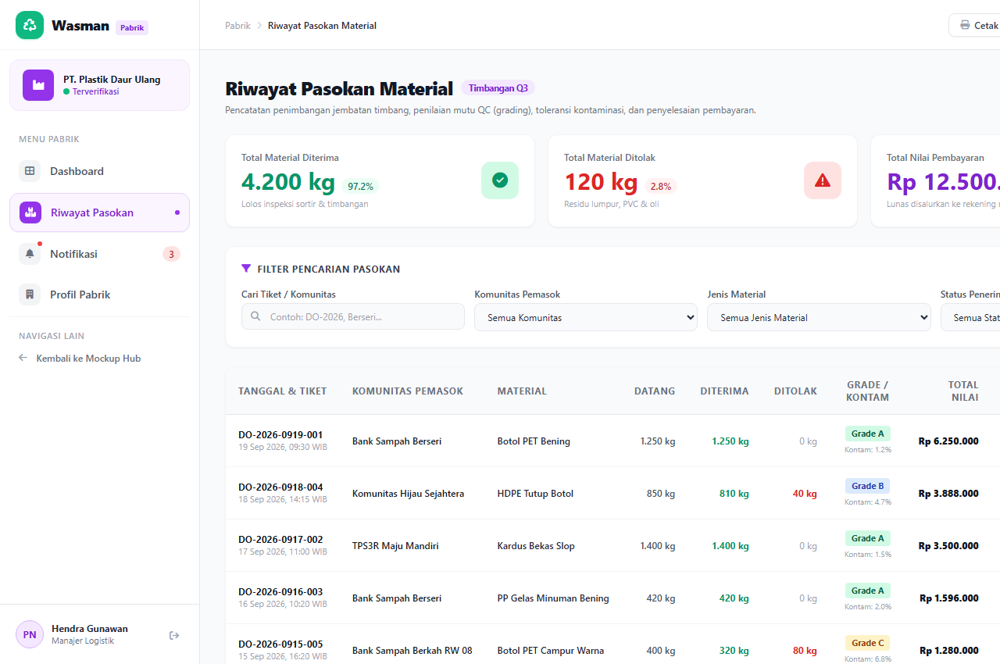 | 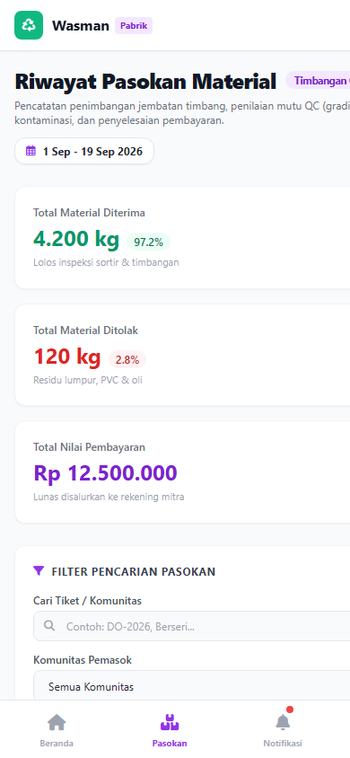 |

---

## 6. Panduan Pengguna 4: Administrator Sistem & DLH (Admin)

Administrator (pengelola sistem atau dinas lingkungan hidup) bertanggung jawab atas tata kelola, validasi ekosistem, serta pemantauan dampak makro.

### 6.1 Dashboard Eksekutif Kota / Wilayah
Dashboard administrator menyajikan visibilitas tingkat tinggi terhadap seluruh dinamika persampahan di wilayah binaan:
- **Statistik Total**: Total pengguna terdaftar, total rumah tangga aktif, jumlah bank sampah terverifikasi, jumlah pabrik mitra, dan total timbulan sampah terkelola (tonase).
- **Rasio Pemilahan (*Sorting Rate*)**: Persentase sampah yang berhasil dipilah dari sumber dan tidak berakhir di Tempat Pemrosesan Akhir (TPA).
- **Peringatan Sengketa (*Dispute Alerts*)**: Deteksi dini transaksi bermasalah antara komunitas dan rumah tangga atau pabrik.
- **Sebaran Geografis**: Grafik volume timbulan sampah per kecamatan/kelurahan.
- **Komposisi Material Kota**: Diagram persentase jenis sampah dominan (plastik, kertas, organik, residu).

| Mode Website (Desktop) | Mode Mobile |
| :---: | :---: |
| 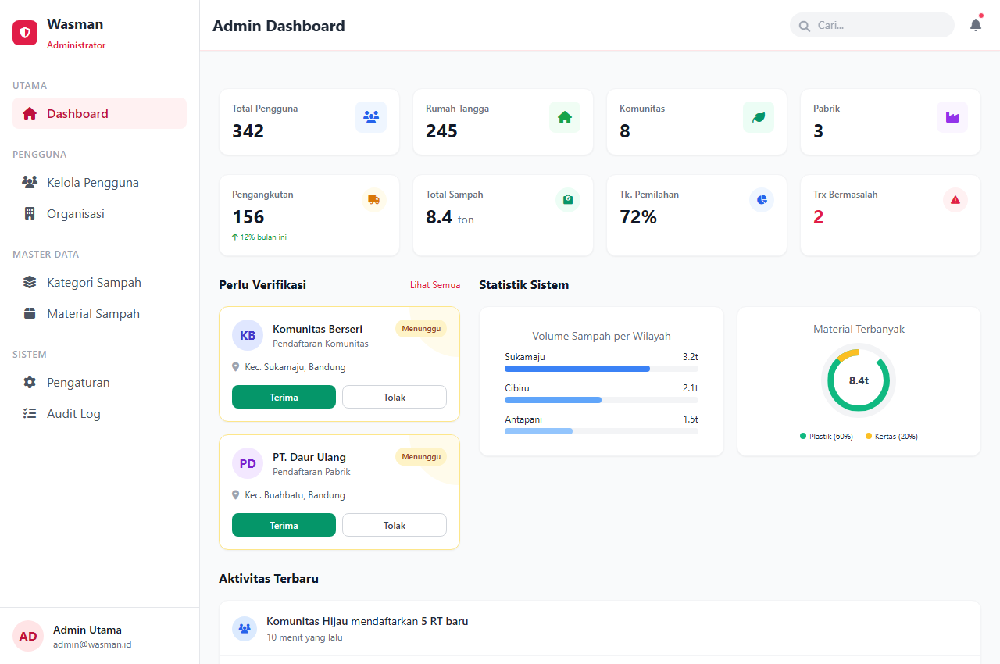 | 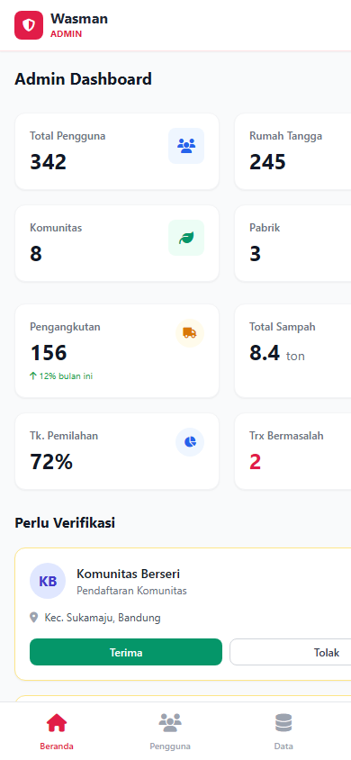 |

---

### 6.2 Tata Kelola Pengguna & Verifikasi Organisasi
Untuk menjaga integritas dan keamanan transaksi, seluruh organisasi yang bergabung harus melalui verifikasi dokumen oleh administrator.

#### 1. Manajemen Pengguna:
- Memantau daftar seluruh akun pengguna lintas peran.
- Melakukan audit status akun (Aktif, Menunggu Verifikasi, Ditangguhkan/Suspend).
- Menangani pemulihan akun atau penutupan akun yang melanggar aturan.

#### 2. Verifikasi Organisasi (Komunitas & Pabrik):
- Meninjau pengajuan pendaftaran komunitas baru, Bank Sampah, dan TPS 3R.
- Memeriksa kelengkapan berkas izin lingkungan, legalitas NIB, dan surat keputusan pembentukan unit.
- Menyetujui (*Terima*) atau menolak permohonan dengan alasan tertulis.

| Menu | Mode Website (Desktop) | Mode Mobile |
|---| :---: | :---: |
| **Manajemen Pengguna** | 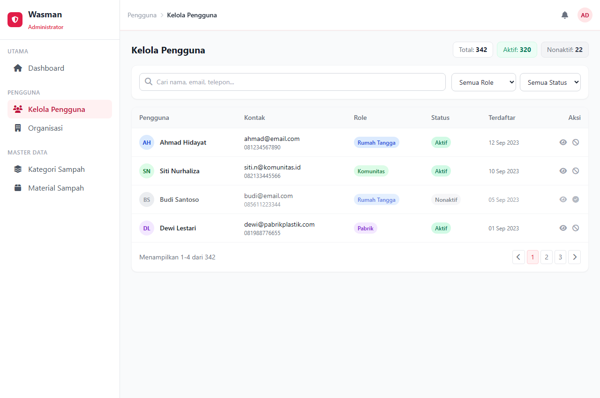 | 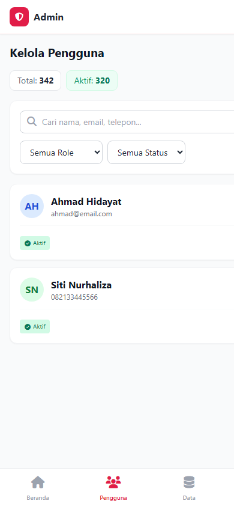 |
| **Verifikasi Organisasi** | 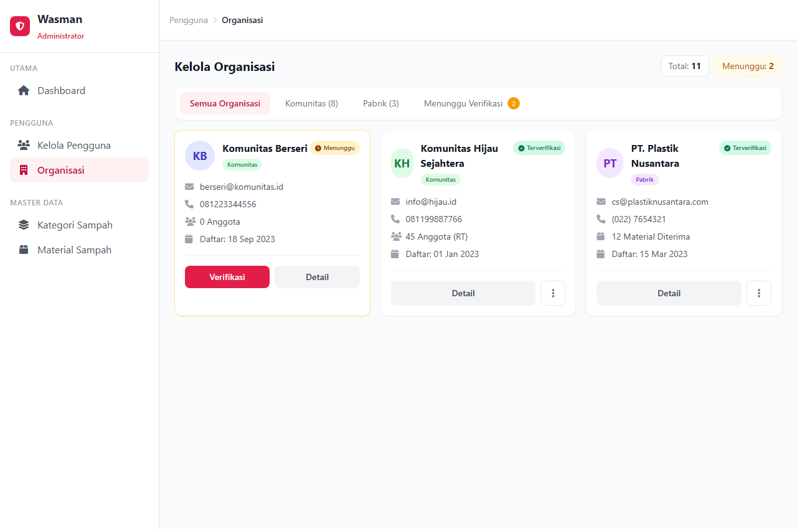 | 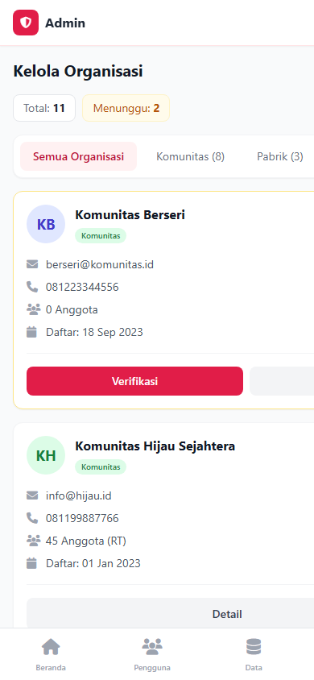 |

---

### 6.3 Master Data Kategori Sampah & Material Acuan Harga
Admin bertindak sebagai penentu kebijakan klasifikasi dan acuan harga pasar guna menghindari persaingan harga yang merugikan warga dan komunitas.

#### 1. Master Data Kategori Sampah:
- Mengatur kategori induk sampah: Organik, Plastik, Kertas, Logam, Kaca, Tekstil, B3 Rumah Tangga, Residu.
- Menentukan aturan penanganan khusus (misal: penanganan limbah B3 memerlukan izin transportasi khusus).

#### 2. Master Data Material & Harga Acuan:
- Menentukan sub-material spesifik (misal: Botol PET Bening, Botol PET Warna, Gelas PP, Kardus Gelombang, Besi Padu, Tembaga).
- Menetapkan rentang **Harga Batas Bawah (*Floor Price*)** dan **Harga Batas Atas (*Ceiling Price*)** sebagai panduan transaksi yang adil antara komunitas dan pabrik.

| Menu | Mode Website (Desktop) | Mode Mobile |
|---| :---: | :---: |
| **Master Kategori Sampah** | 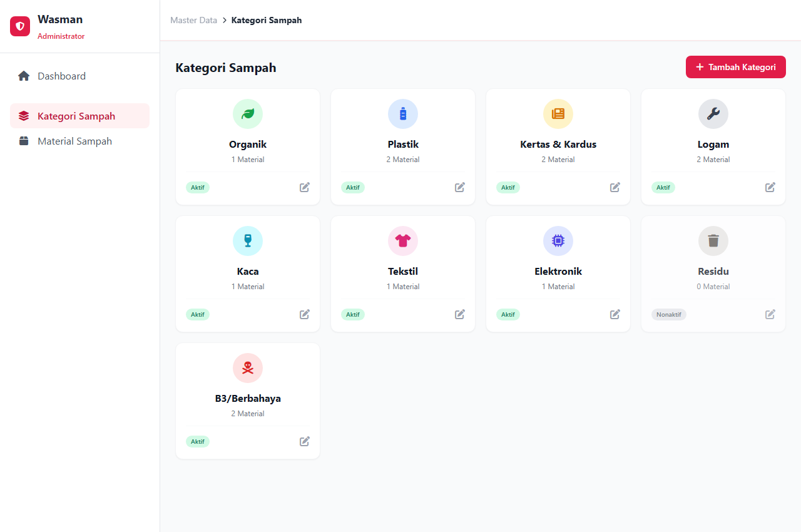 | 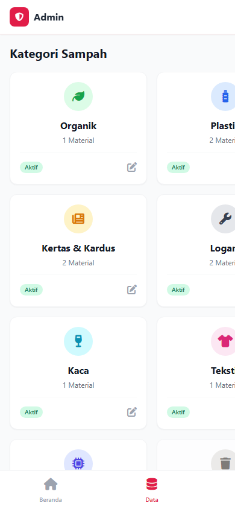 |
| **Master Material & Harga Acuan** | 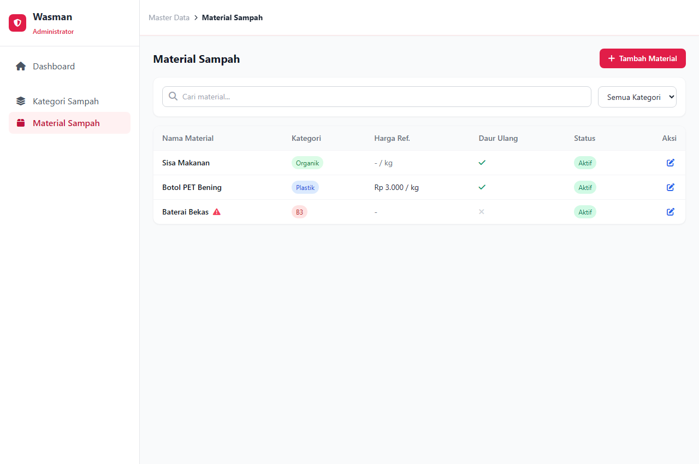 | 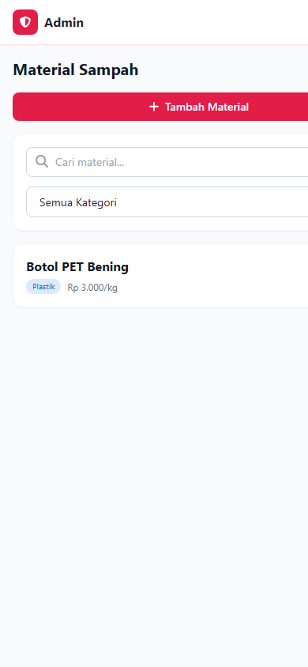 |

---

## 7. Standard Operating Procedure (SOP) Alur Bisnis Sirkular

Berikut adalah diagram alir end-to-end yang mengilustrasikan bagaimana keempat pengguna saling berinteraksi dalam ekosistem Wasman:

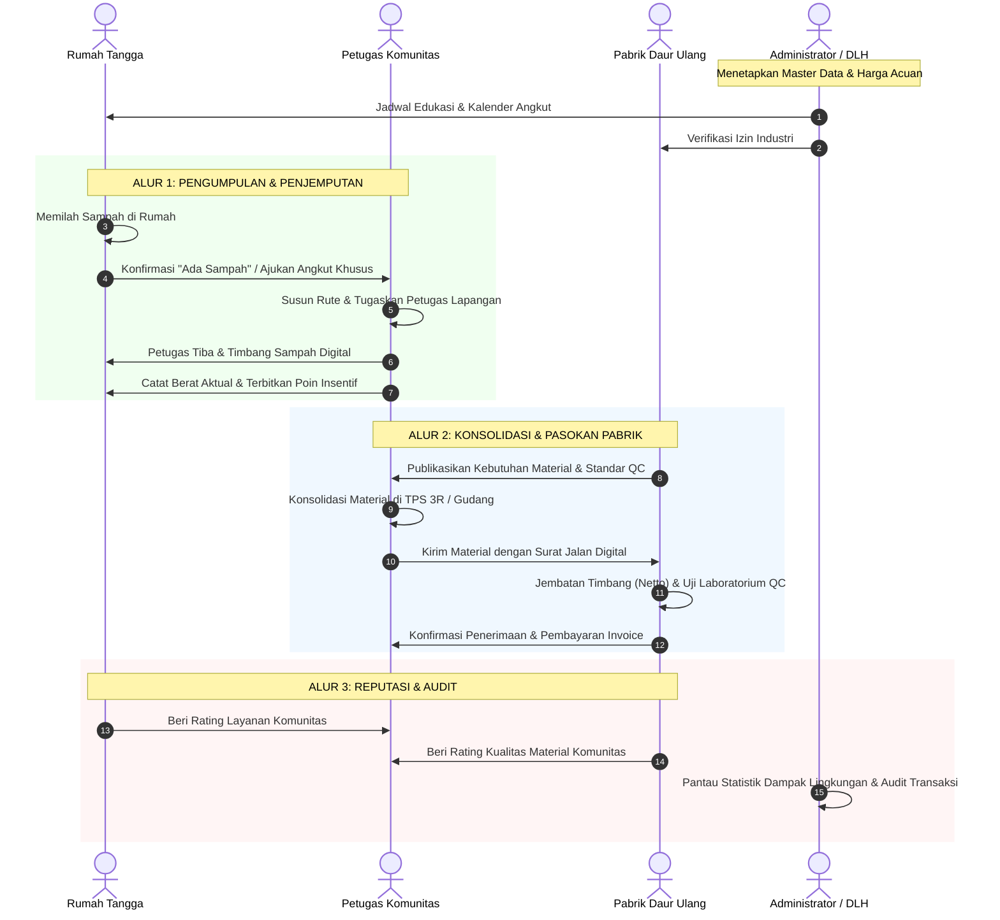
```mermaid
sequenceDiagram
    autonumber
    actor W as Rumah Tangga
    actor K as Petugas Komunitas
    actor P as Pabrik Daur Ulang
    actor A as Administrator / DLH

    Note over A: Menetapkan Master Data & Harga Acuan
    A->>W: Jadwal Edukasi & Kalender Angkut
    A->>P: Verifikasi Izin Industri

    rect rgb(240, 255, 240)
        Note over W,K: ALUR 1: PENGUMPULAN & PENJEMPUTAN
        W->>W: Memilah Sampah di Rumah
        W->>K: Konfirmasi "Ada Sampah" / Ajukan Angkut Khusus
        K->>K: Susun Rute & Tugaskan Petugas Lapangan
        K->>W: Petugas Tiba & Timbang Sampah Digital
        K->>W: Catat Berat Aktual & Terbitkan Poin Insentif
    end

    rect rgb(240, 248, 255)
        Note over K,P: ALUR 2: KONSOLIDASI & PASOKAN PABRIK
        P->>K: Publikasikan Kebutuhan Material & Standar QC
        K->>K: Konsolidasi Material di TPS 3R / Gudang
        K->>P: Kirim Material dengan Surat Jalan Digital
        P->>P: Jembatan Timbang (Netto) & Uji Laboratorium QC
        P->>K: Konfirmasi Penerimaan & Pembayaran Invoice
    end

    rect rgb(255, 245, 245)
        Note over W,P: ALUR 3: REPUTASI & AUDIT
        W->>K: Beri Rating Layanan Komunitas
        P->>K: Beri Rating Kualitas Material Komunitas
        A->>A: Pantau Statistik Dampak Lingkungan & Audit Transaksi
    end
```

### 7.1 Matriks Transparansi Finansial & Bagi Hasil
Sebagai contoh skenario: 1 kilogram botol plastik PET bersih dijual oleh Komunitas kepada Pabrik dengan harga **Rp 3.000 / kg**:
- **Insentif Rumah Tangga (Warga)**: Rp 1.500 (50%) — dialokasikan dalam bentuk poin atau saldo tunai atas kesadaran memilah dari sumber.
- **Jasa Angkut & Pengolahan Komunitas**: Rp 1.100 (36,7%) — digunakan untuk honor petugas lapangan, bahan bakar armada, dan operasional Bank Sampah.
- **Dana Lingkungan & Edukasi RT/RW**: Rp 250 (8,3%) — digunakan untuk kegiatan kebersihan lingkungan dan pembinaan warga.
- **Biaya Pemeliharaan Platform Wasman**: Rp 150 (5,0%) — untuk pemeliharaan server, cloud, dan pengembangan sistem.

---

## 8. Panduan Teknis & Akses Mockup Interaktif

Untuk meninjau prototipe antarmuka secara interaktif di browser lokal:
1. Buka berkas [mockups/index.html](mockups/index.html) di peramban web Google Chrome atau Mozilla Firefox.
2. Menu mockup interaktif mencakup seluruh 31 halaman yang tersusun rapi berdasarkan peran pengguna:
   - **Landing Page**: `mockups/landingpage.html`
   - **Autentikasi**: `mockups/auth/login.html`, `mockups/auth/register.html`
   - **Rumah Tangga**: `mockups/household/*.html` (9 halaman)
   - **Komunitas**: `mockups/community/*.html` (10 halaman)
   - **Pabrik**: `mockups/factory/*.html` (3 halaman)
   - **Admin**: `mockups/admin/*.html` (5 halaman)

Seluruh tangkapan layar beresolusi tinggi tersimpan di direktori:
- **Tampilan Website (Desktop)**: `docs/screenshots/desktop/`
- **Tampilan Mobile (Smartphone)**: `docs/screenshots/mobile/`

---

## 9. Kesimpulan

Platform **Wasman** mendemokratisasi pengelolaan sampah di perkotaan dengan menghadirkan keterbukaan data, insentif finansial yang nyata, serta efisiensi operasional. Dengan memfasilitasi 4 tipe pemangku kepentingan dalam satu aplikasi terpadu yang responsif (Website & Mobile PWA), Wasman menjadi solusi konkret dalam mendukung program nasional pengurangan sampah serta mewujudkan ekosistem ekonomi sirkular yang inklusif dan berkelanjutan.
